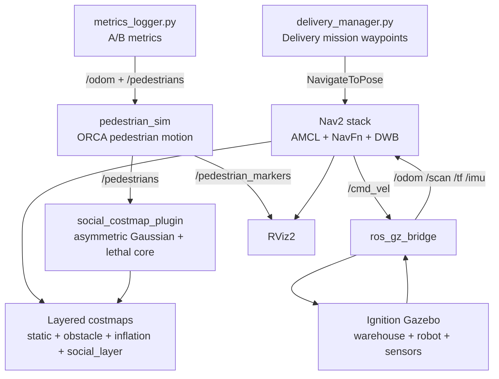

# Autonomous Mobile Robot Navigation in an Environment with Humans

A ROS 2 Humble workspace for a simulated autonomous delivery robot that
navigates a warehouse with moving pedestrians. The system uses the Nav2 stack
and adds a custom social costmap layer so the robot avoids people based on both
their current position and walking direction.

The core contribution is `social_costmap_plugin`: a C++ Nav2 layer that paints
a velocity-scaled, asymmetric Gaussian cost field around each pedestrian, plus a
lethal body radius. This makes the global planner and local controller route
around a person's projected path instead of treating pedestrians as static
points.

Author: **AshwinderPalSingh**

---

## Media Placeholders

Upload screenshots or diagrams to `docs/images/` using the filenames below.
The README already references them so the images will render automatically on
GitHub after upload.

| View | Image slot |
|---|---|
| Gazebo warehouse simulation |  |
| RViz Nav2 stack and robot model |  |
| Social costmap around pedestrians |  |
| Full system flow / architecture |  |
| A/B comparison: baseline vs social layer |  |

---

## Highlights

- Full ROS 2 Humble workspace with seven packages.
- Differential-drive delivery robot modeled in URDF/Xacro.
- Ignition Fortress / Gazebo warehouse world with shelves, walls, boxes, and a
  pillar.
- Nav2 navigation with AMCL, NavFn, DWB, map server, local/global costmaps, and
  RViz configuration.
- Custom Nav2 social costmap plugin in C++.
- Pedestrian simulator in Python using ORCA / RVO2 collision avoidance.
- Custom pedestrian message interfaces for position and velocity.
- A/B evaluation workflow comparing baseline navigation against social-aware
  navigation.
- Metrics logger for path length, run duration, closest pedestrian distance,
  and personal-space intrusions.

---

## Technology Stack

| Area | Tools |
|---|---|
| Middleware | ROS 2 Humble Hawksbill |
| Simulation | Ignition Fortress / Gazebo |
| Navigation | Nav2, NavFn, DWB, AMCL |
| Mapping | slam_toolbox |
| Robot model | URDF, Xacro |
| Social navigation | Custom Nav2 costmap layer |
| Pedestrian motion | Python-RVO2 / ORCA |
| Visualization | RViz2 |
| Target OS | Ubuntu 22.04 |

---

## Repository Layout

```text
social_nav_ws/
├── README.md
├── PROJECT_EXPLANATION.txt
├── docs/
│   ├── DESIGN.md
│   └── images/
└── src/
    ├── delivery_bot_bringup/
    ├── delivery_bot_description/
    ├── delivery_bot_gazebo/
    ├── delivery_bot_navigation/
    ├── pedestrian_sim/
    ├── social_costmap_plugin/
    └── social_nav_msgs/
```

---

## Package Overview

| Package | Type | Purpose |
|---|---|---|
| `social_nav_msgs` | `ament_cmake` | Defines `Pedestrian` and `Pedestrians` messages used by the simulator and costmap plugin. |
| `social_costmap_plugin` | `ament_cmake`, C++ | Custom Nav2 costmap layer that adds velocity-aware social costs around pedestrians. |
| `pedestrian_sim` | `ament_python` | Publishes moving pedestrians and RViz markers; uses ORCA / RVO2 for pedestrian collision avoidance. |
| `delivery_bot_description` | `ament_cmake` | Robot URDF/Xacro model, sensors, joints, Gazebo plugins, and robot state publisher launch. |
| `delivery_bot_gazebo` | `ament_cmake` | Ignition Fortress warehouse world, robot spawning, and ROS-Gazebo bridge launch. |
| `delivery_bot_navigation` | `ament_cmake` | Nav2, AMCL, SLAM, saved map, and RViz configuration. |
| `delivery_bot_bringup` | `ament_python` | Top-level orchestration launch, delivery mission manager, and metrics logger. |

---

## System Architecture



---

## How Social Navigation Works

The pedestrian simulator publishes each pedestrian's id, position, and velocity
on `/pedestrians`.

The `social_costmap_plugin` subscribes to this topic and updates the Nav2
costmap:

1. **Lethal body radius**  
   Cells inside `lethal_radius` are marked as lethal obstacles. The robot should
   never plan through a person's body.

2. **Velocity-aware asymmetric Gaussian**  
   A moving pedestrian receives a cost field stretched in the direction of
   travel:

   ```text
   sigma_front = sigma_base * (1 + speed_factor * speed)
   sigma_back  = sigma_base
   sigma_side  = sigma_base * sigma_side_ratio
   ```

   This means the robot gives more clearance in front of a walking person and
   can pass more naturally behind them.

3. **Passable but expensive field**  
   The Gaussian peak is kept below the lethal value. If a person blocks the only
   corridor, the planner can still produce a cautious path instead of failing
   immediately.

4. **Max merge policy**  
   Social costs only raise the master costmap value. They never erase real
   obstacles detected by lidar or loaded from the map.

Default social layer parameters:

| Parameter | Default | Meaning |
|---|---:|---|
| `amplitude` | `220.0` | Peak social cost below lethal. |
| `sigma_base` | `0.45 m` | Base personal-space radius. |
| `sigma_side_ratio` | `0.6` | Side clearance multiplier. |
| `speed_factor` | `1.6` | Forward stretch per m/s of pedestrian speed. |
| `lethal_radius` | `0.30 m` | Hard no-go radius around the pedestrian. |
| `cutoff` | `15.0` | Ignore smaller costs for efficient updates. |

---

## Pedestrian Simulation

Pedestrians are simulated as a ROS node rather than Gazebo actors. This keeps
the navigation contribution isolated from perception and makes the A/B
experiment clear: without the social layer, the robot cannot see the simulated
pedestrians because they are not lidar obstacles.

The simulator:

- loads pedestrian paths from `src/pedestrian_sim/config/pedestrians.yaml`;
- uses ORCA / RVO2 to avoid other pedestrians, obstacles, and the robot;
- injects the robot pose from `/odom` as an ORCA agent;
- publishes `/pedestrians` for the costmap plugin;
- publishes `/pedestrian_markers` for RViz visualization.

---

## Installation

These instructions assume Ubuntu 22.04 with ROS 2 Humble.

```bash
sudo apt update
sudo apt install -y \
  ros-humble-desktop \
  ros-humble-ros-gz \
  ros-humble-navigation2 \
  ros-humble-nav2-bringup \
  ros-humble-slam-toolbox \
  ros-humble-nav2-simple-commander \
  ros-humble-teleop-twist-keyboard \
  ros-humble-xacro \
  ros-humble-joint-state-publisher-gui \
  python3-colcon-common-extensions \
  python3-rosdep \
  cmake \
  build-essential
```

Install Python-RVO2 for pedestrian ORCA simulation:

```bash
pip3 install Cython
git clone https://github.com/sybrenstuvel/Python-RVO2.git
cd Python-RVO2
pip3 install .
cd ..
python3 -c "import rvo2"
```

If the final command prints no output, the package imported successfully.

---

## Build

Clone the repository and build from the workspace root:

```bash
git clone https://github.com/AshwinderPalSingh/Autonomous-mobile-robot-navigation-in-enviroment-with-humans.git
cd Autonomous-mobile-robot-navigation-in-enviroment-with-humans
rosdep update
rosdep install --from-paths src --ignore-src -r -y
colcon build --symlink-install
source install/setup.bash
```

On a VM or a headless machine, use software rendering if Gazebo fails to open:

```bash
export LIBGL_ALWAYS_SOFTWARE=1
```

---

## Run the Project

### 1. Gazebo simulation only

```bash
source install/setup.bash
ros2 launch delivery_bot_gazebo sim.launch.py
```

In another terminal:

```bash
source install/setup.bash
ros2 run teleop_twist_keyboard teleop_twist_keyboard
```

Verification:

```bash
ros2 topic hz /scan
ros2 topic hz /odom
ros2 topic hz /joint_states
ros2 run tf2_tools view_frames
```

### 2. Build or regenerate the map

```bash
source install/setup.bash
ros2 launch delivery_bot_bringup sim_bringup.launch.py mode:=slam rviz:=True
```

Drive the robot around the warehouse with teleop, then save the map:

```bash
ros2 run nav2_map_server map_saver_cli \
  -f src/delivery_bot_navigation/maps/warehouse
colcon build --packages-select delivery_bot_navigation --symlink-install
source install/setup.bash
```

### 3. Run Nav2 without pedestrians

```bash
source install/setup.bash
ros2 launch delivery_bot_bringup sim_bringup.launch.py mode:=nav pedestrians:=False
```

Use RViz `2D Goal Pose` to validate point-to-point navigation.

### 4. Run full social navigation

```bash
source install/setup.bash
ros2 launch delivery_bot_bringup sim_bringup.launch.py mode:=nav
```

Expected RViz behavior:

- pedestrian markers are visible;
- global and local costmaps show social cost fields around pedestrians;
- moving pedestrians create elongated cost fields ahead of their velocity;
- the global plan bends around personal space instead of cutting through it.

---

## Delivery Mission

Run the full delivery route after the simulation and Nav2 are active:

```bash
source install/setup.bash
ros2 run delivery_bot_bringup delivery_manager --ros-args \
  --params-file install/delivery_bot_bringup/share/delivery_bot_bringup/config/mission.yaml
```

The mission manager sends sequential Nav2 goals and reports success, failure,
timeout, and total navigation time for each route leg.

---

## A/B Evaluation

The project is designed for a direct comparison:

- **Baseline A:** social layer disabled.
- **Social B:** social layer enabled.

The same delivery mission is used for both runs.

### Social run

Terminal 1:

```bash
source install/setup.bash
ros2 run delivery_bot_bringup metrics_logger --ros-args \
  -p label:=social \
  -p use_sim_time:=true
```

Terminal 2:

```bash
source install/setup.bash
ros2 run delivery_bot_bringup delivery_manager --ros-args \
  --params-file install/delivery_bot_bringup/share/delivery_bot_bringup/config/mission.yaml
```

Stop `metrics_logger` with `Ctrl-C` after the mission report prints.

### Baseline run

Disable the social layer:

```bash
ros2 param set /global_costmap/global_costmap social_layer.enabled false
ros2 param set /local_costmap/local_costmap social_layer.enabled false
```

Then repeat the logger and mission commands:

```bash
source install/setup.bash
ros2 run delivery_bot_bringup metrics_logger --ros-args \
  -p label:=baseline \
  -p use_sim_time:=true
```

```bash
source install/setup.bash
ros2 run delivery_bot_bringup delivery_manager --ros-args \
  --params-file install/delivery_bot_bringup/share/delivery_bot_bringup/config/mission.yaml
```

Expected result:

| Metric | Baseline | Social-aware |
|---|---|---|
| Minimum pedestrian distance | Lower | Higher |
| Personal-space intrusions | More | Fewer |
| Path length | Shorter | Slightly longer |
| Duration | Shorter | Slightly longer |

The trade-off is intentional: the robot accepts a modest route/time cost to
reduce personal-space violations around humans.

---

## Live Tuning

The social layer parameters can be changed while the system is running:

```bash
ros2 param set /global_costmap/global_costmap social_layer.amplitude 180.0
ros2 param set /global_costmap/global_costmap social_layer.speed_factor 2.2
ros2 param set /global_costmap/global_costmap social_layer.sigma_base 0.5
```

Apply the same changes to `/local_costmap/local_costmap` when you want both
global planning and local control to use the same tuning.

---

## Important Topics

| Topic | Type | Direction |
|---|---|---|
| `/clock` | `rosgraph_msgs/Clock` | Gazebo to ROS nodes |
| `/cmd_vel` | `geometry_msgs/Twist` | Nav2 to Gazebo diff drive |
| `/odom` | `nav_msgs/Odometry` | Gazebo to Nav2 and pedestrian simulator |
| `/tf` | `tf2_msgs/TFMessage` | Gazebo, AMCL/SLAM, robot state publisher |
| `/scan` | `sensor_msgs/LaserScan` | Gazebo lidar to Nav2 |
| `/pedestrians` | `social_nav_msgs/Pedestrians` | pedestrian simulator to social layer |
| `/pedestrian_markers` | `visualization_msgs/MarkerArray` | pedestrian simulator to RViz |
| `/map` | `nav_msgs/OccupancyGrid` | map server or slam_toolbox to Nav2 |

---

## TF Design

The project follows one rule: one transform, one owner.

```text
map -> odom                 AMCL or slam_toolbox
odom -> base_footprint      Gazebo DiffDrive plugin
base_footprint -> base_link robot_state_publisher
base_link -> sensors/links  robot_state_publisher
```

This avoids duplicate TF publishers and keeps Nav2, SLAM, Gazebo, and RViz in
agreement.

---

## Troubleshooting

| Problem | Likely fix |
|---|---|
| `/scan` is not publishing | Check the Gazebo sensor plugins and ROS-Gazebo bridge strings. |
| SLAM reports transform errors | Check sensor frame ids in `gazebo.xacro`. |
| Costmap does not show in RViz | Use transient local durability for map/costmap displays. |
| `delivery_manager` waits forever | Confirm `localizer` in `mission.yaml` matches AMCL vs SLAM mode. |
| Gazebo opens black or crashes in a VM | Run `export LIBGL_ALWAYS_SOFTWARE=1`. |
| Robot avoids pedestrians too aggressively | Lower `social_layer.amplitude` or `speed_factor`. |
| Robot passes too close to pedestrians | Increase `sigma_base`, `speed_factor`, or `amplitude`. |

---

## Current Limitations

- Pedestrian perception is ground truth from simulation.
- Pedestrian prediction uses current velocity rather than learned multi-step
  trajectory forecasting.
- The project currently demonstrates one robot, not a namespaced multi-robot
  fleet.
- The social model is a classical costmap baseline, intended as a measurable
  foundation for future learned social navigation work.

---

## Future Work

- Replace ground-truth pedestrian messages with real detection and tracking.
- Add learned trajectory prediction as input to the social costmap.
- Add automated experiment scripts for repeated A/B trials.
- Add plots generated from metrics CSV files.
- Extend the launch setup for multiple robots with namespaced Nav2 stacks.
- Add CI for message generation, plugin compilation, and Python linting.

---

## Documentation

- `PROJECT_EXPLANATION.txt` contains a complete project walkthrough.
- `docs/DESIGN.md` explains design decisions, cost model details, TF ownership,
  and evaluation framing.
- `src/delivery_bot_navigation/maps/README.md` explains map regeneration.

---

## License

This project is licensed under the Apache License 2.0.

---

## Author

**AshwinderPalSingh**
